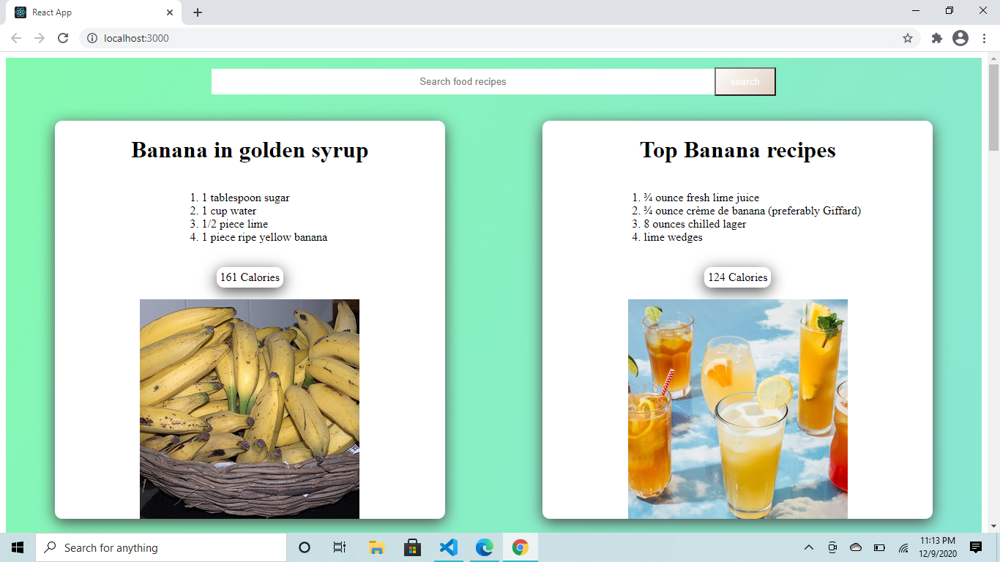

# Recipe App
Here I have created a Recipe App which is fetching the data from "EDAMAM API" and showing the recipes of the different foods.

## Run locally
To run locally on your machine, clone the project or download and run "npm start"

## Visulization of App

## Deployed site on Netlify

https://trusting-austin-57fe8c.netlify.app